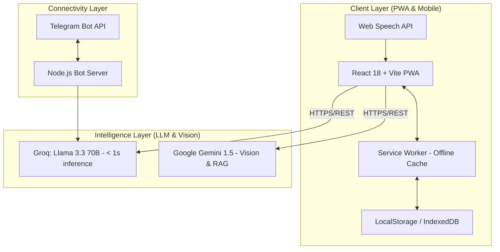
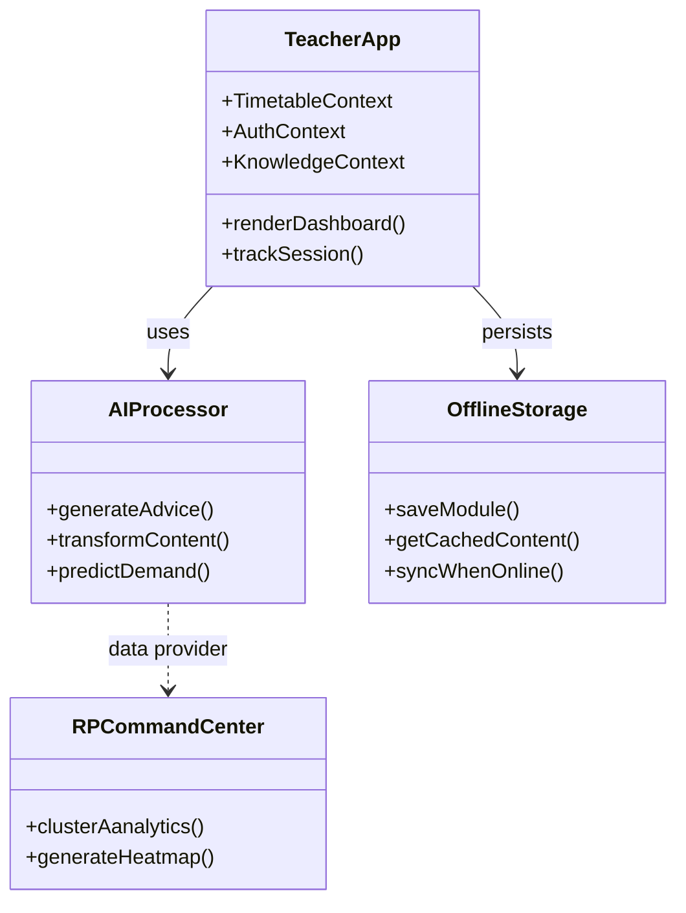
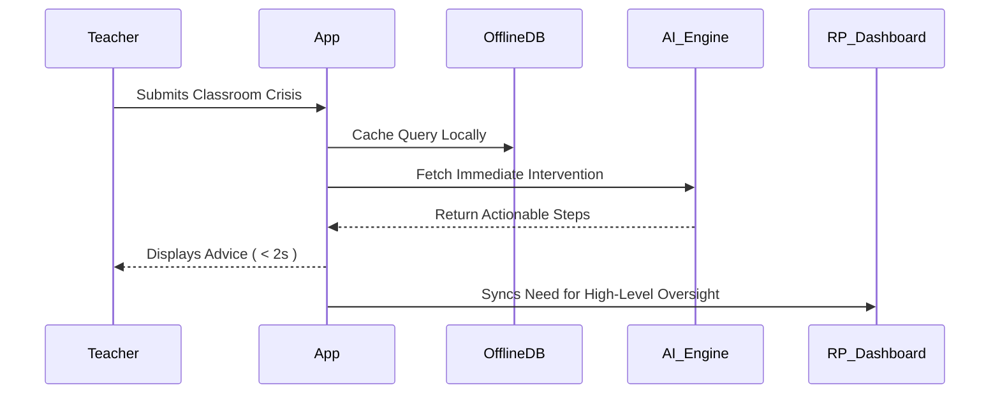

# ShikshaAssistant 🎓

> **AI-Powered Just-in-Time Professional Support for Government School Teachers**

---

## 🌟 The Problem We Solve

Government school teachers in India receive training in workshops, but implementation happens alone in the classroom. When a lesson fails or a student misbehaves, there's no mentor to call. This **"Implementation Gap"** leads to:
- Pedagogical innovation dying after training
- Teacher burnout and isolation
- No data on what teachers actually need

**ShikshaAssistant** bridges this gap with **instant, AI-powered support** available 24/7.

---

## 🚀 Key Features

### For Teachers

| Feature | Description |
|---------|-------------|
| 🎙️ **Live Pulse Advisor** | Describe your classroom problem, get evidence-based solutions in < 3 seconds |
| 📚 **AI Module Generator** | Transform PDFs/textbooks into bite-sized interactive courses |
| 🎭 **Simulation Arena** | Practice handling angry parents or chaotic classrooms with AI role-play |
| 🔬 **Frugal Science Lab** | Scan everyday objects, get science experiments that need ₹0 |
| 📊 **AI Assessment Copilot** | Analyze student performance, get personalized intervention strategies |
| 📝 **Daily Session Reflection** | AI-guided journaling with pattern detection and growth tracking |
| 👆 **Agency Engine** | Tinder-style swipe interface to signal training needs |
| 📱 **Telegram Bot** | 24/7 support on your phone via `@teacher_support_321_bot` |
| 📅 **Dynamic Timetable** | Persisted daily roadmap with real-time editing and task tracking |

### For Resource Persons (ARP/BRP/CRP)

| Feature | Description |
|---------|-------------|
| 📈 **Command Center Dashboard** | Real-time visibility into teacher needs across schools |
| 🔮 **Predictive Training Analysis** | AI forecasts upcoming training demands 2-4 weeks early |
| 🗺️ **Visit Priority Planner** | AI-ranked school visit list based on urgency |
| 📊 **Cluster Health Heatmaps** | At-a-glance view of which schools need attention |

---

## 🏗️ Technical Architecture

### System Architecture

### UML Component Overview

### Data Flow (Interaction Sequence)

---

## 🎯 Feature Deep Dives

### 1. Live Pulse Advisor
Real-time AI support for classroom emergencies. Teachers describe their problem and receive structured advice:
- 🤝 **I Understand** - Emotional validation
- 🎯 **The Issue** - Problem restatement
- ✅ **Do This Right Now** - 2-3 actionable steps
- 💪 **You've Got This** - Encouragement

### 2. AI Module Generator (Resource Evolution Suite)
Transforms any educational content into micro-learning experiences:
- **Mermaid Visualizations**: Automatically generates diagrams from text.
- **Micro-assessments**: 3-5 quiz questions created per topic.
- **NCERT Context**: RAG-enhanced responses for curriculum alignment.

### 3. Simulation Arena
AI role-play for practicing high-stakes human interactions:
- Parent meetings, student discipline, administrative conflicts.
- Real-time scoring and pedagogical feedback.

### 4. Frugal Science Lab
Computer vision-powered TLM generator:
- Recognizes household trash and suggests curriculum experiments.
- Reduces dependency on high-cost laboratory equipment.

---

## 📱 Offline Capabilities

ShikshaAssistant is built **Offline-First**:
- ✅ **PWA Service Workers**: All application logic is cached on the first visit.
- ✅ **LocalDatabase**: User accounts, timetables, and generated modules are saved to `localStorage`.
- ✅ **Seamless Sync**: Offline actions are queued and synced once connectivity is restored.

---

## 🌐 Multi-Language Support

The platform uses a dedicated translation engine supporting **11+ Indian languages** including Hindi, Telugu, Tamil, Marathi, Bengali, and Kannada.

---

## 📦 Installation & Setup

1. **Clone & Install**: `git clone https://github.com/oki-dokii/ShikshaLokam.git && cd diet-command-center && npm install`
2. **Environment**: Setup `.env` with `VITE_GROQ_API_KEY` and `VITE_GOOGLE_API_KEY`.
3. **Run**: `npm run dev`

---

  <strong>Built with ❤️ for India's Teachers</strong>

