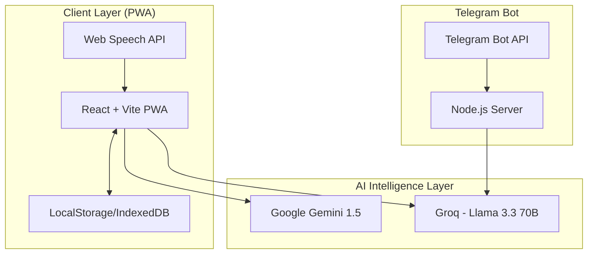

# ShikshaAssistant 🎓

> **AI-Powered Just-in-Time Professional Support for Government School Teachers**

[](https://shikshalokam.onrender.com)
[](https://t.me/teacher_support_321_bot)

---

## 🌟 The Problem We Solve

Government school teachers in India receive training in workshops, but implementation happens alone in the classroom. When a lesson fails or a student misbehaves, there's no mentor to call. This **"Implementation Gap"** leads to:
- Pedagogical innovation dying after training
- Teacher burnout and isolation
- No data on what teachers actually need

**ShikshaAssistant** bridges this gap with **instant, AI-powered support** available 24/7.

---

## 🚀 Key Features

### For Teachers

| Feature | Description |
|---------|-------------|
| 🎙️ **Live Pulse Advisor** | Describe your classroom problem, get evidence-based solutions in < 3 seconds |
| 📚 **AI Module Generator** | Transform PDFs/textbooks into bite-sized interactive courses |
| 🎭 **Simulation Arena** | Practice handling angry parents or chaotic classrooms with AI role-play |
| 🔬 **Frugal Science Lab** | Scan everyday objects, get science experiments that need ₹0 |
| 📊 **AI Assessment Copilot** | Analyze student performance, get personalized intervention strategies |
| 📝 **Daily Session Reflection** | AI-guided journaling with pattern detection and growth tracking |
| 👆 **Agency Engine** | Tinder-style swipe interface to signal training needs |
| 📱 **Telegram Bot** | 24/7 support on your phone via `@teacher_support_321_bot` |

### For Resource Persons (ARP/BRP/CRP)

| Feature | Description |
|---------|-------------|
| 📈 **Command Center Dashboard** | Real-time visibility into teacher needs across schools |
| 🔮 **Predictive Training Analysis** | AI forecasts upcoming training demands 2-4 weeks early |
| 🗺️ **Visit Priority Planner** | AI-ranked school visit list based on urgency |
| 📊 **Cluster Health Heatmaps** | At-a-glance view of which schools need attention |
| 🎙️ **Voice Report Generation** | Speak to generate compliance reports |

---

## 🏗️ Technical Architecture



**Tech Stack:**
- **Frontend**: React 18, TypeScript, Vite, TailwindCSS, Framer Motion
- **AI**: Groq (Llama 3.3 70B), Google Gemini 1.5 (Vision)
- **Bot**: Node.js, node-telegram-bot-api
- **PWA**: VitePWA for offline support
- **Deployment**: Render (Web), Vercel-ready

---

## 📦 Installation

### Web Application

```bash
# Clone the repository
git clone https://github.com/oki-dokii/ShikshaLokam.git
cd ShikshaLokam/diet-command-center

# Install dependencies
npm install

# Set up environment variables
cp .env.example .env
# Edit .env with your API keys

# Start development server
npm run dev
```

### Telegram Bot

```bash
cd telegram-bot

# Install dependencies
npm install

# Set up environment variables
cp .env.example .env
# Add your TELEGRAM_BOT_TOKEN and GROQ_API_KEY

# Start the bot
npm start
```

### Environment Variables

```env
# Web App (.env)
VITE_GROQ_API_KEY=your_groq_api_key
VITE_GOOGLE_API_KEY=your_google_api_key

# Telegram Bot (.env)
TELEGRAM_BOT_TOKEN=your_telegram_bot_token
GROQ_API_KEY=your_groq_api_key
GROQ_API_KEY_BACKUP=your_backup_groq_key
```

---

## 🎯 Feature Deep Dives

### 1. Live Pulse Advisor
Real-time AI support for classroom emergencies. Teachers describe their problem and receive structured advice:
- 🤝 **I Understand** - Emotional validation
- 🎯 **The Issue** - Problem restatement
- ✅ **Do This Right Now** - 2-3 actionable steps
- 💪 **You've Got This** - Encouragement

### 2. AI Module Generator (Resource Evolution Suite)
Transforms any educational content into Udemy-style micro-courses:
- PDF/text upload → Interactive modules
- 150-200 word detailed lessons
- Auto-generated visualizations (flowcharts, mindmaps)
- 3-5 quiz questions per module
- NCERT RAG Mode for curriculum alignment

### 3. Simulation Arena
AI role-play for difficult scenarios:
- Angry parent confrontations
- Classroom discipline situations
- Administrative conflicts
- Post-scenario coaching feedback

### 4. Frugal Science Lab
Computer vision-powered TLM generator:
- Scan available objects
- Get ₹0-cost science experiments
- Curriculum-aligned activities
- Step-by-step instructions

### 5. Telegram Bot (@teacher_support_321_bot)
24/7 teacher support on mobile:
- No app download required
- Works on 2G networks
- Multi-language support (11 Indian languages)
- Context-aware responses

### 6. RP Command Center
Unified dashboard for Resource Persons:
- Role-based views (BRP/ARP/CRP)
- Training demand heatmaps
- Predictive analytics
- Voice-enabled report generation

---

## 📱 Offline Capabilities

ShikshaAssistant is built **Offline-First** for rural deployment:
- ✅ PWA with service worker caching
- ✅ Generated courses saved to localStorage
- ✅ "Load Last Saved" for offline access
- ✅ Works without internet after first load

---

## 🌐 Multi-Language Support

| Language | Code |
|----------|------|
| Hindi | hi |
| Telugu | te |
| Tamil | ta |
| Marathi | mr |
| Bengali | bn |
| Gujarati | gu |
| Kannada | kn |
| Malayalam | ml |
| Punjabi | pa |
| Odia | or |
| English | en |

---

## 📊 Demo Credentials

For testing the application:
- **Teacher Login**: Any email/password
- **ARP/BRP Login**: Any email/password (redirects to Command Center)

---

## 🔗 Live Links

| Resource | URL |
|----------|-----|
| 🌐 Web App | [shikshalokam.onrender.com](https://shikshalokam.onrender.com) |
| 📱 Telegram Bot | [t.me/teacher_support_321_bot](https://t.me/teacher_support_321_bot) |
| 📂 GitHub Repo | [github.com/oki-dokii/ShikshaLokam](https://github.com/oki-dokii/ShikshaLokam) |

---

## 📄 Documentation

- [ARCHITECTURE.md](./ARCHITECTURE.md) - System architecture and methodology
- [COMPREHENSIVE_GUIDE.md](./COMPREHENSIVE_GUIDE.md) - Full feature documentation
- [SOLUTION_DEFINITION.md](./SOLUTION_DEFINITION.md) - Problem statement and solution
- [REQUIREMENT_MAPPING.md](./REQUIREMENT_MAPPING.md) - Requirement compliance matrix

---

## 🛠️ Development

```bash
# Run development server
npm run dev

# Build for production
npm run build

# Preview production build
npm run preview

# Run linting
npm run lint
```

---

## 🤝 Contributing

1. Fork the repository
2. Create your feature branch (`git checkout -b feature/AmazingFeature`)
3. Commit your changes (`git commit -m 'Add some AmazingFeature'`)
4. Push to the branch (`git push origin feature/AmazingFeature`)
5. Open a Pull Request

---

## 📝 License

This project is licensed under the MIT License.

---

## 🙏 Acknowledgments

- **ShikshaLokam** for the problem statement and vision
- **Groq** for blazing-fast LLM inference
- **Google Gemini** for vision capabilities
- All the government school teachers whose challenges inspired this solution

---

<p align="center">
  <strong>Built with ❤️ for India's Teachers</strong>
</p>
