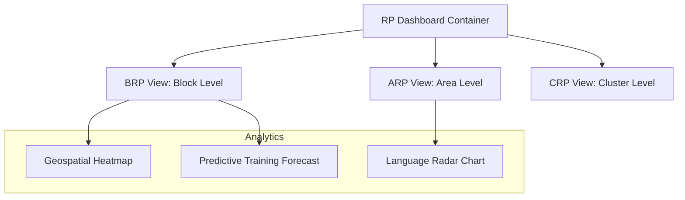
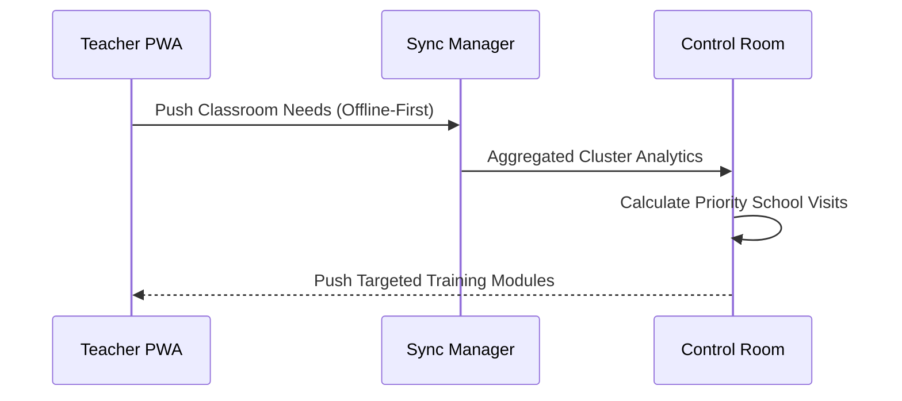

# ShikshaAssistant: DIET Command Center (Control Room) 🛰️

This is the **Resource Person (ARP/BRP/CRP)** management suite for the ShikshaAssistant ecosystem. It provides district-level oversight and predictive analytics to support teachers on the ground.

---

## 🏗️ Technical Architecture

### Component Hierarchy


### Data Synchronization Flow


---

## 🚀 Key Admin Features

1.  **Command Center Dashboard**: Real-time visibility into teacher needs across schools.
2.  **Predictive Training Analysis**: AI forecasts upcoming training demands 2-4 weeks early based on "Agency Engine" swipes.
3.  **Cluster Health Heatmaps**: At-a-glance view of which schools need urgent administrative intervention.
4.  **Language Proficiency Radar**: Detailed breakdown of pedagogical skills across different medium of instruction.

---

## 📦 Getting Started

This component is part of the `diet-command-center` monorepo.

```bash
cd diet-command-center
npm install
npm run dev
```

---

<p align="center">
  <strong>DIET Command Center • Empowering Education Administrators</strong>
</p>